# Configuración bot de Telegram

Este proyecto contiene tres bots que automatizan la descarga y transmisión de videos y audios desde enlaces proporcionados por los usuarios a través de Telegram. Se utilizan tecnologías como `yt-dlp`, `ffmpeg`, `Flask` y `Icecast` para procesar los contenidos.

## Estructura de archivos

```bash
backend.py
bot.py
Docker
Dockerfile
└── entrypoint.sh
icecast.py
README.md
```

## Diagrama de flujo 

```mermaid
flowchart LR

    subgraph Grupo_A ["Telegram Container"]
        B[Bot]
        DV[Backend.py]
        DA[Icecast.py]
        DVf["/videos"]
        DAf["/songs"]
        yt[yt_dlp]
        ff[ffmpeg]
    end

    subgraph Grupo_B ["Nginx Container"]
        PV["/var/www/webpages/videos/hls/stream.m3u8"]
        VV[video.html]
        URLV["fondomarcador.com/videos"]
    end

    subgraph Grupo_C ["ICES2 Container"]
        ICES[ICES2]
        ICESf["/songs"]
    end

    subgraph Grupo_D ["Icecast Container"]
        ICECAST[Icecast Server]
        STREAM["fondomarcador.com/icecast"]
    end

    C[Cliente]

    C --> |1: dv/da| B
    B --> |2: dv/Download URL|DV
    B --> |2: da/Download URL|DA
    DV --> |"3: Descarga de archivos (yt_dlp)"|yt
    yt --> |"4: Convertir a hls con ffmpeg"|ff
    ff --> |"5: Guardar archivo convertido en /videos"|DVf
    DA --> |"3: Descarga de archivos (yt_dlp)"|yt
    yt --> |"4: Convertir a ogg con ffmpeg"|ff
    ff --> |"5: Guardar archivo convertido en /songs"|DAf
    DVf -->|6: Montar los videos en Nginx|PV
    PV --> |7: video.html toma como source el archivo stream.m3u8|VV
    VV --> |8: Mostrar en la página el video|URLV
    URLV --> |9: El cliente ve el video|C

    DAf -->|6: Monta la música en ICES2|ICESf
    ICESf -->|7: ICES2 toma la música y la transmite a Icecast|ICES
    ICES -->|8: Stream de audio en vivo|ICECAST
    ICECAST -->|9: Clientes acceden al stream de audio|STREAM
    STREAM -->|10: Cliente escucha la radio|C
```



## `Dockerfile` - [Dockerfile](./Docker/Dockerfile)

Este Dockerfile es el encargado de tener las dependencias y librerias, además de iniciar automáticamente los .py

## `bot.py` - [Configuración del Bot](./bot.py)

Este bot interactúa con los usuarios a través de comandos y gestiona la comunicación con los servidores de procesamiento de video y audio.

### Funcionalidad

1. **Comandos disponibles**:
   - `/start`: Muestra un mensaje de bienvenida.
   - `/dv`: Solicita un enlace de video para transmitir.
   - `/da`: Solicita un enlace de audio para transmitir.
   - `/cancel`: Cancela la operación en curso.
   - `/commands`: Muestra los comandos disponibles.

2. **Manejo de URLs**:
   - Los comandos `/dv` y `/da` activan una conversación donde el usuario debe enviar una URL válida.
   - Se verifica que la URL comience con `http://` o `https://`.
   - Luego, se envía al backend correspondiente (`backend.py` para video o `icecast.py` para audio).

3. **Recepción y respuesta**:
   - Si el backend responde con éxito, el bot devuelve un enlace de streaming.
   - Si hay un error, el bot notifica al usuario.

---

## `backend.py` - [Configuración de Video](./backend.py)

Este servidor Flask recibe URLs de videos, los descarga y los convierte en un formato adecuado para streaming.

### Funcionalidad

1. **Recibe una URL desde el bot de Telegram** a través de `POST /process`.
2. **Descarga el video** usando `yt-dlp` en la mejor calidad disponible.
3. **Convierte el video a HLS** con `ffmpeg`, generando fragmentos `.ts` y una lista de reproducción `.m3u8`.
4. **Responde con la URL del stream** para que el bot la comparta con el usuario.

### Código del proceso

```python
@app.route("/process", methods=["POST"])
def process_stream():
    data = request.get_json()
    url = data.get("url", "")
    
    ydl_opts = {
        'outtmpl': os.path.join(DOWNLOAD_DIR, '%(title)s.%(ext)s'),
        'format': 'bestvideo+bestaudio/best',
        'merge_output_format': 'mp4',
    }
    with yt_dlp.YoutubeDL(ydl_opts) as ydl:
        result = ydl.extract_info(url, download=True)
        output_file = ydl.prepare_filename(result)
    
    command = [
        "ffmpeg", "-i", output_file, "-c:v", "libx264", "-preset", "veryfast",
        "-b:v", "800k", "-c:a", "aac", "-f", "hls", "-hls_time", "10",
        "-hls_list_size", "0", "-hls_segment_filename", os.path.join(DOWNLOAD_DIR, "segment_%03d.ts"),
        os.path.join(DOWNLOAD_DIR, "stream.m3u8")
    ]
    subprocess.Popen(command)
    
    return jsonify({"stream_link": "https://fondomarcador.com/videos/"})
```

---

## `icecast.py` - [Configuración de Audio](./icecast.py)

Este servidor Flask descarga audios y los transmite a través de Icecast.

### Funcionalidad

1. **Recibe una URL desde el bot de Telegram** a través de `POST /process_audio`.
2. **Descarga el audio** con `yt-dlp` en formato Ogg Vorbis.
3. **Agrega el archivo a una lista de reproducción** utilizada por Icecast.
4. **Responde con la URL del stream** para que el bot la comparta con el usuario.

### Código del proceso

```python
@app.route("/process_audio", methods=["POST"])
def process_audio():
    data = request.get_json()
    url = data.get("url", "")
    
    ydl_opts = {
        'format': 'bestaudio/best',
        'outtmpl': os.path.join(DOWNLOAD_DIR, '%(title)s.%(ext)s'),
        'postprocessors': [{
            'key': 'FFmpegExtractAudio',
            'preferredcodec': 'vorbis',
            'preferredquality': '5',
        }],
    }
    with yt_dlp.YoutubeDL(ydl_opts) as ydl:
        result = ydl.extract_info(url, download=True)
        output_file = ydl.prepare_filename(result).replace(".webm", ".ogg").replace(".m4a", ".ogg")
        final_path = os.path.join(DOWNLOAD_DIR, os.path.basename(output_file))
        os.rename(output_file, final_path)
    
    with open(PLAYLIST_FILE, "a") as playlist:
        playlist.write(final_path + "\n")
    
    return jsonify({"stream_link": "https://fondomarcador.com/icecast/"})
```
